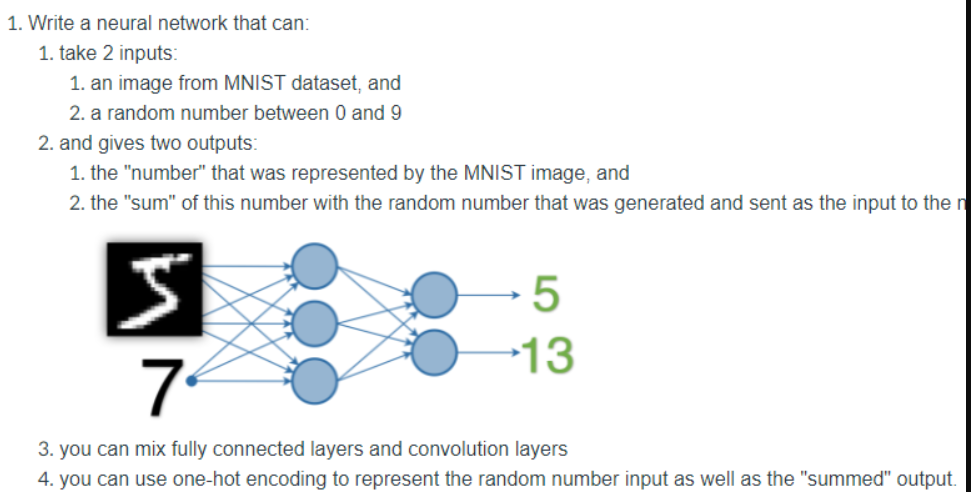
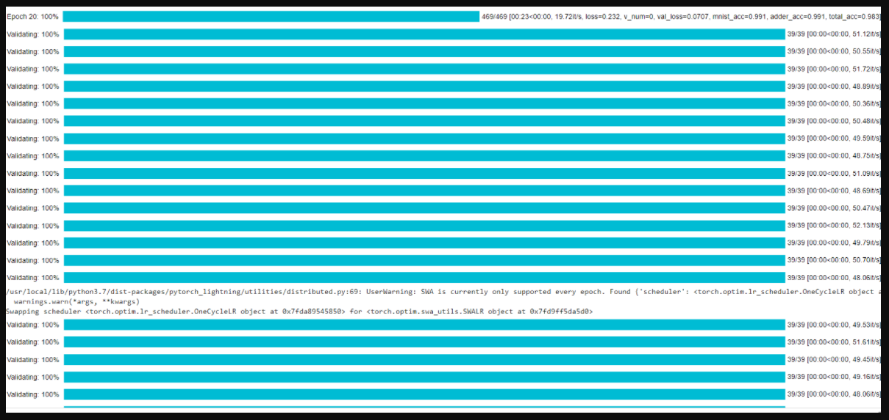

    <h1>
       Chapter 3 : It Knows: How to Read  

### This Document is Submitted as part of END 3 Session 3.

## Contributors

* [Seetharaman Sikamani](https://github.com/seetha1971)
* [Umesh Birajdar](https://github.com/Umeshtriveni)
* [Srikanth Kandarp](https://github.com/silicon-ninja)

---
## Table of Contents
   
- [Problem Statement](#problem-statement)
- [Data Representation](#data-representation)
- [Data Generation Strategy](#data-generation-strategy)
- [Loss function](#loss-function)
- [Result](#result) 
   
---
## Problem Statement

To write a neural network that can take two inputs:
an image from MNIST dataset, and
a random number between 0 and 9

and gives two outputs:

the "number" that was represented by the MNIST image, and
the "sum" of this number with the random number that was generated and sent as the input to the network

## Data Representation
The inputs come from a 28x28 image from MNIST and a random number from 0 to 9.

## Data Generation Strategy
We use a modified version of MNIST class called MNISTRandAdder.
It adds a random number along with the mnist image, and the target now is the mnist image's target + the random number
    *For example: [MNIST Image for 1], 5 => 1, 6*

## Loss function
Cross entropy measures entropy between two probability distributions and since we're dealing with different classes we chose cross entropy.

## Result

